# AI Logo Generator Using DCGAN

  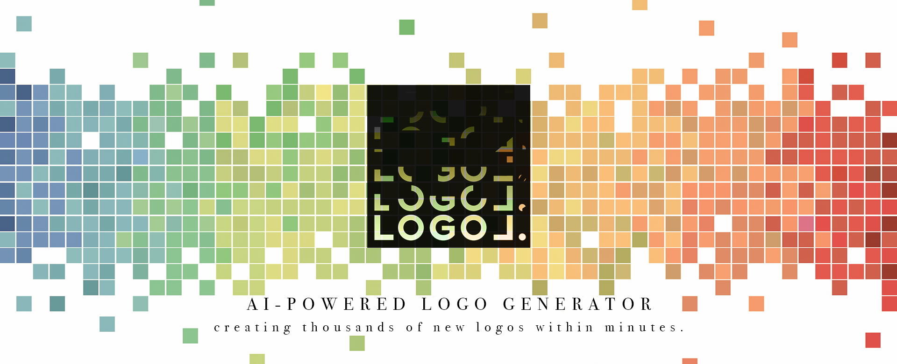

## LOGOL - Xccelerate Data Science and Machine Learning Capstone Project 
LOGO⅃ is an AI logo generator that aims creating large amount of quality logos within seconds and providing alternative solutions for advertising as well as creative industries. Through using LLD dataset provided for establishing the prototype of different GAN models in the early stage of our project for trial purposes to see the differences among the GANs while later obtaining over 365k logos from App Store to training our final DCGAN model, we have suceeded in creating an user-friendly and instant logo generator through deep learning model.

## Table of Content
<ol>

<li> <a href="#intro">Introduction</a> </li>
<li> <a href="#datacollection">Data Collection</a> </li>

  <ol> 
  <li> <a href="#lld">LLD Large Logo Dataset</a> </li>
  <li> <a href="#ios">365k IOS Apps Dataset</a> </li>
  </ol>
  
<li> <a href="#results">Results</a> </li>

  <ol> 
  <li> <a href="#120k">Uncategorized 120k dataset</a> </li> 
  <li> <a href="#gc">Games Category</a> </li> 
  <li> <a href="#tp">Training Processes</a></li> 
  <li> <a href="#dd">Deployment</a> </li> 
  </ol>
  
<li><a href="#loss"> The Loss of Generator and Discriminator with 120k Dataset</a> </li> 
<li> <a href="#spec">Specifications & Time</a> </li> 
  <ol>
  <li> <a href="#mac">MacBook Pro</a> </li> 
  <li> <a href="#gcp">GCP AI VM Instances</a></li> 
  </ol>
  
<li> <a href="#limit">Limitations</a> </li> 

  <ol>
  <li><a href="#mc"> Mode Collapse </a></li> 
  <li><a href="#nc"> Non-convergence <a> </li> 
  </ol>
  
<li> <a href="#pitch">Pitch</a></li> 
<li> <a href="#references">References</a></li> 
<li> <a href="#team">Team Members</a></li> 

</ol>

## Data Collection 

#### - LLD Large Logo Dataset

<a href="https://data.vision.ee.ethz.ch/cvl/lld/">LLD dataset</a> [1] contains various logo dataset with different amount and resolution of logo in which we have chosen two of the datasets provided:

1.   **5,000** logos with low resolution (32x32)

2.   **122,920** logos with high resolution (400x400)

#### - 365k IOS Apps Dataset

<a href="https://www.kaggle.com/fentyforte/365k-ios-apps-dataset">365k IOS Apps Dataset</a> [2] is created by us using Rapid API to acquire the data we need and we have scraped over 10,000,000 data but we have filtered out the data rows with incomplete information so there are only 365k data left. We have used 5 Jupyter Notebooks at the same time to scrape thus download the logos which took us around 2 days using the Macbook Pro (specification mentioned below).

## Model Architectural Diagram

  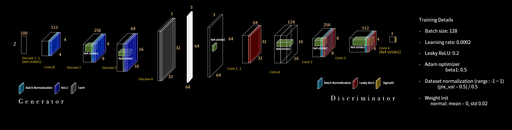

## Results 

### Uncategorized 120k dataset
<table align="center">
  <tr>
    <th>Training Images</th>
    <th>DCGAN 72th Epoch</th>
  </tr>
  <tr>
    <th>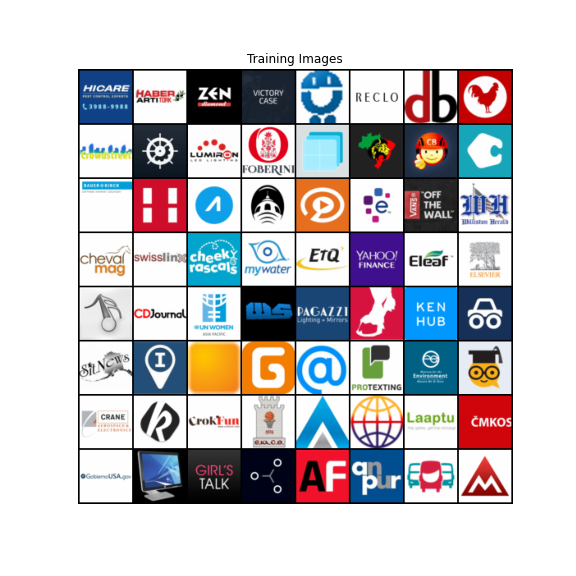</th>
    <th>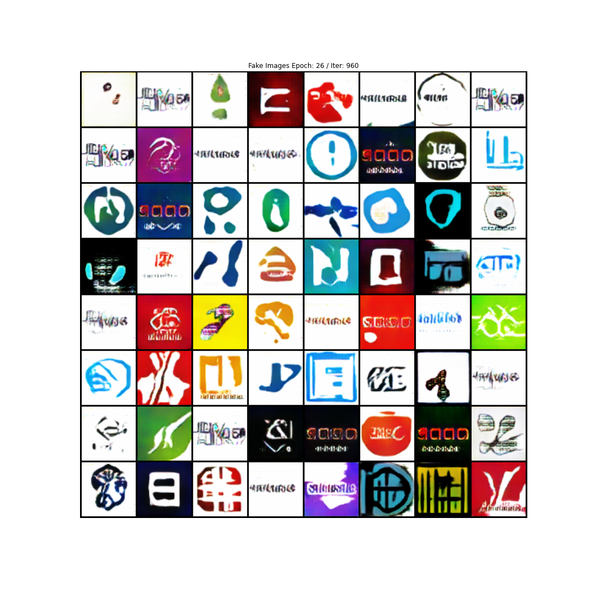</th>
  </tr>
  
</table>

### Games Category

<table align="center">
  <tr>
    <th>Training Images</th>
    <th>DCGAN 141th Epoch</th>
  </tr>
  <tr>
    <th>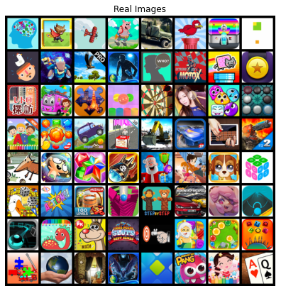</th>
    <th>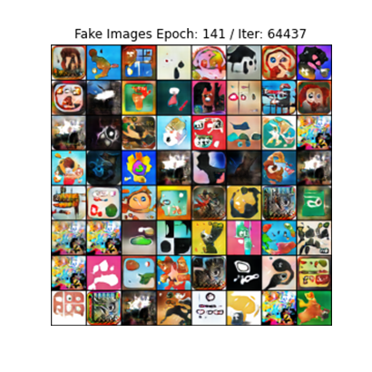</th>
  </tr>
  
</table>

### Training Processes

<table align="center">
  <tr>
    <th>DCGAN with 120k img</th>
    <th>DCGAN with 58k img (Games Category)</th>
  </tr>
  <tr>
    <th></th>
    <th></th>
  </tr>
  
</table>

--- Although we have trained the DCGAN model with 100-200 epochs, we only need the best performing generator among the 100 epoch in which we have chosen the 72th epoch's generator for 120k dataset and 60th epoch for game category of logos.

### Deployment

#insert gif here

## **The Loss of Generator and Discriminator with 120k Dataset**

  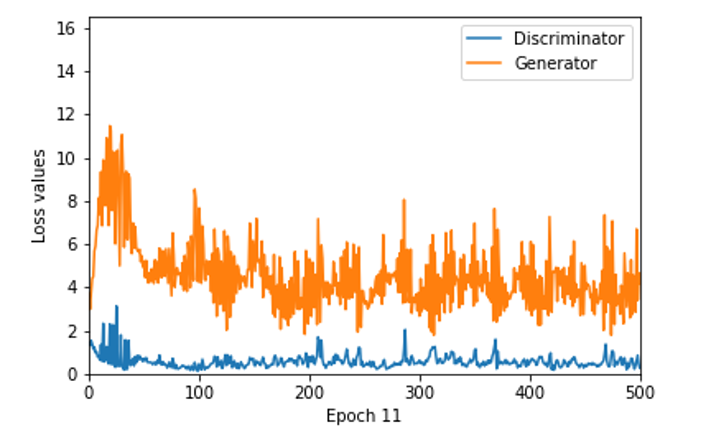

## Specifications & Time 
 
We have scaled down 365,915 images from 512x512 pixels to 64x64 pixels for training our DCGAN model due to our limited computational power and financial status.  
The following are the specifications of computer/VM instances & time used for training DCGAN:   

### **MacBook Pro**   
**CPU**: 2.3GHz 8-Cppre Intel Core i9  
**RAM**: 32 GM 2667 MHz DDR4  
**Graphic Card**: Intel UHD Graphics 630 1536MB   

**Time Required**(120k): 
100 epochs/96100 iterations with 120k images: ~**4.25** days  
1 epoch/961 iterations: ~**3800-4200** seconds  
1000 iterations: ~**4200-4400** seconds   

### **GCP AI VM Instances**   
**Environment**: PyTorch 1.6  
**Machine Type**: 4 vCPUs, 15 GB RAM  
**GPUs**: NVIDIA Tesla T4 x 1  

**Time Required**(365k): 
100 Epochs/ 285800 Iterations: ~**5990** seconds  
1 epoch/2858 iterations: ~**666** seconds  
1000 iterations: ~**233** seconds   

The entire project took us around **1 month** to finish.

## Limitations

### 1. Mode Collapse
Training could fall into mode collapse where the Generator collaspsed and is only capable of generating a small subset of different outcomes

<table align="center">

  <tr>
    <th>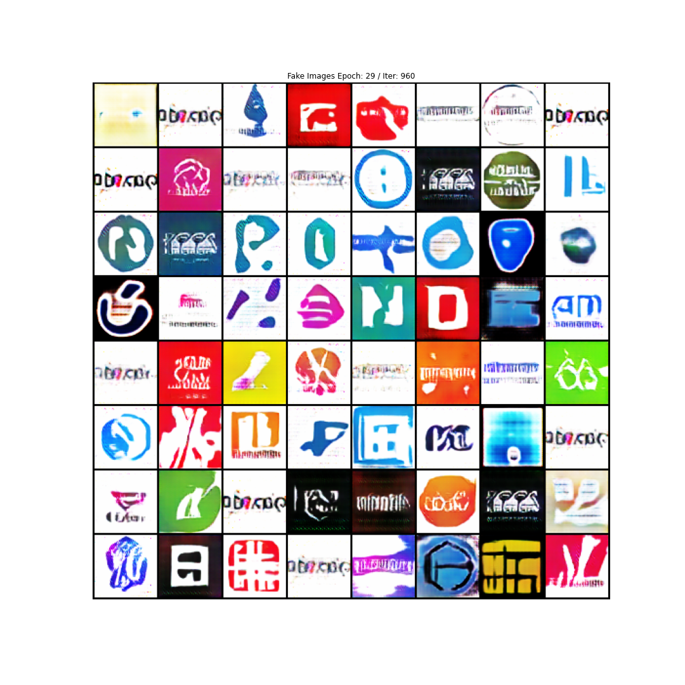</th>
    <th>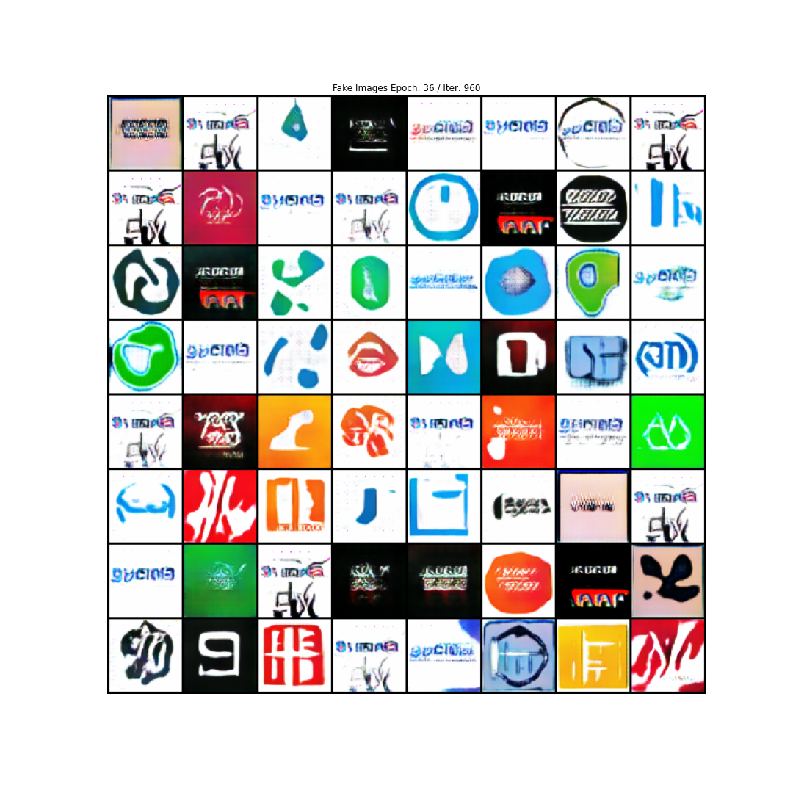</th>
  </tr>
  
</table>

### 2. Non-convergence
The model parameters oscillate, destabilize and never converge.

  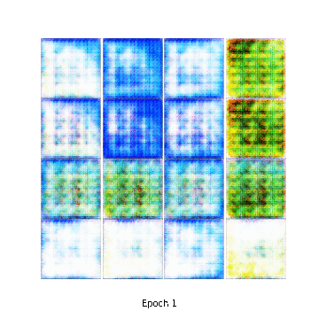

## Pitch

  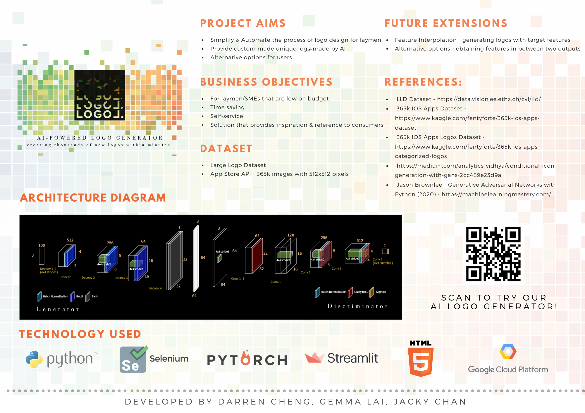

## References
1. LLD Dataset - https://data.vision.ee.ethz.ch/cvl/lld/
2. 365k IOS Apps Dataset - https://www.kaggle.com/fentyforte/365k-ios-apps-dataset
3. 365k IOS Apps Logos Dataset - https://www.kaggle.com/fentyforte/365k-ios-apps-categorized-logos
4. https://medium.com/analytics-vidhya/conditional-icon-generation-with-gans-2cc489e23d9a
5. Jason Brownlee - Generative Adversarial Networks with Python (2020) - https://machinelearningmastery.com/

## Team Members:

**Darren Cheng**
- Frontend & Backend Web Development
- Cloud Deployment

**Gemma Lai**
- Image Collection & Preprocessing
- Computer Vision Model Engineering

**Jacky Chan**
- Computer Vision Model Engineering & Evaluation
- Cloud Deployment

